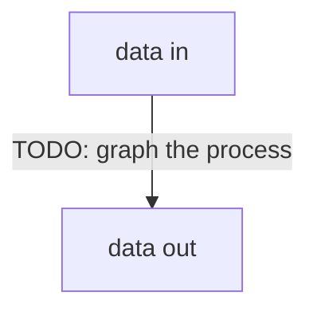

# Architecture

TODO: https://matklad.github.io/2021/02/06/ARCHITECTURE.md.html

MainApp: trying to detect multiple transactions of the same size in the flow, only then check for identity of the wallet.
